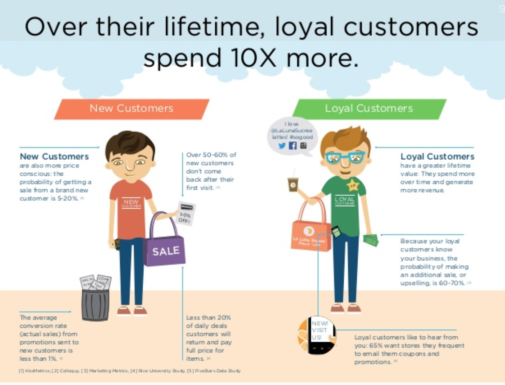
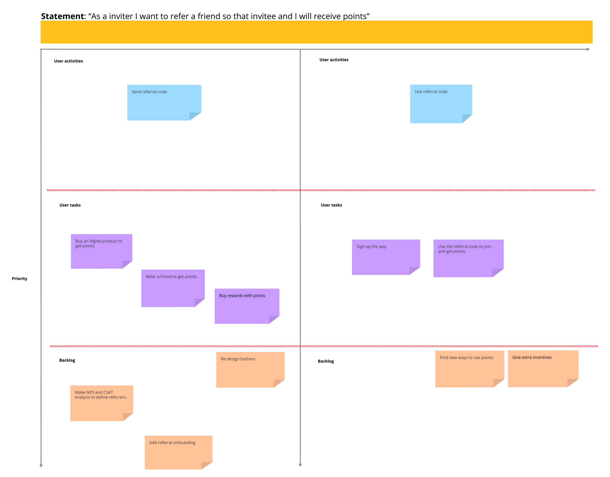
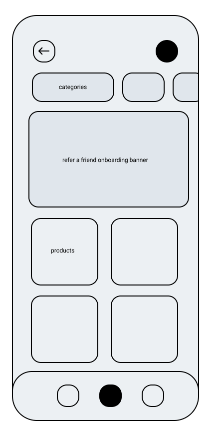

# Case Study - Algida ile Kazan

<aside>
💡 You joined Kaizen Technology as a Product Manager. You have got a goal to increase
user acquisition with new features. After workshops, one of the selected idea is “Friend
Invitation” for ”Algida ile Kazan”.

</aside>

When it comes to customer acquisition channels, your thoughts are usually drawn to SEO, paid advertising, and influencer marketing. Referral marketing is a missing piece of the puzzle that enhances the impact of all your acquisition efforts.

Referral marketing is one of the most powerful acquisition techniques with a high return on investment since it depends on direct referrals from trustworthy shoppers.

<aside>
💡 **User Type :** Consumers (End-User)
**Channels :** “Algida ile Kazan”, Android App, IOS App,
**Environments :** Development / Test / Production
**Brief Intro:** “Algida ile Kazan” is a very popular loyalty & engagement program which is
used by Algida Consumers. As a team we are aiming to increase user base (acquisition)
with “Friend Invitation” feature.

**Invitation Code :** As an inviter, users can create & access invitation code which is an
identifier for friend invitation.
**Share:** Invitation code can be shared via multiple ways (ie whatsapp).
Points:

- Inviter Points:
    - Inviter gets X points if invited user (invitee) register & login to app,
    - ie inviter gets 50 Points
- Invitee Points:
    - Invitee get Y points after invitee registration & login.
    - ie invitee gets 100 Points
</aside>

In this case even it’s not given in the brief, points could be used to get Algida products, digital codes, discount coupons etc. via application. Points could be earned with using the code on the Algida product or referring a friend to the application.

## Objectives/Strategies

In order to increase user acquisition, retention and reduce churn rate and acquisition costs, referral programs is a really important piece of the pie. To build a successful referral program, there are some strategies/objectives that I’d like to suggest.

### 1- Focusing on Engagement

If the application is successful on keep their users engaged to the application, they will increase the possibility of getting referred. Gamification is one of the most important things in that specific objective.

### 2- Give Incentives to Users

In order to encourage your user base to refer the application to a friend. Discount coupons, premium features, chance to try new products etc. would increase the attention of both inviter and invitee users.

### 3- Make the Correct Users to Refer

With using analytics like CSAT and NPS helps you to see that which users are currently satisfied by the service that they’re getting from the application. Higher the CSAT and NPS score means they could have higher possibility to refer the application and share their good experience with their friends.

### 4- Correct Timing

It’s just simple. If you’re trying to get referral from a customer who has been using the application more, the possibility of getting a referral would increase. It won’t be right to show pop-up for referral to a new customer who is just downloaded the application and exploring the ocean.

### 5- Onboarding

Some features stay in the shadows while using the application. There are so many call to action buttons, interesting banners etc. in the application’s main page but referral option might not be the most interesting one. If you have a good onboarding flow showing how to refer a friend and earn points while doing that, it could increase the success rate.

## User Story

With using time and priority as axis of the graph, user story of prepared below.

## User Flow Diagrams

User flow diagram is prepared for both inviter and invitee

### Inviter’s Flow

### Invitee’s Flow

## Wireframe

